# 🧬 Gene Expression Signature as Biomarkers for Cancer Detection

<p align="center">
  
  
  
  
  
</p>

<p align="center">
  <strong>A Predictive Model Approach for Early Cancer Diagnosis using Machine Learning</strong><br>
  MSc Bioinformatics Dissertation | Teesside University, UK
</p>

---

## 📋 Table of Contents
- [Overview](#overview)
- [Key Findings](#key-findings)
- [Dataset](#dataset)
- [Methodology](#methodology)
- [Machine Learning Models](#machine-learning-models)
- [Results](#results)
- [Repository Structure](#repository-structure)
- [Installation & Usage](#installation--usage)
- [Technologies](#technologies)
- [Future Work](#future-work)
- [Author & Contact](#author--contact)
- [Acknowledgments](#acknowledgments)
- [Citation](#citation)

---

## 🔬 Overview

Cancer is one of the most prevalent diseases globally and remains a primary cause of death worldwide according to WHO. **Early detection is crucial** for improving survival rates and treatment outcomes. This project develops a **machine learning-based predictive model** to identify cancer through gene expression signatures, enabling early diagnosis and personalized treatment strategies.

### Why This Matters

- 🩺 **Late diagnosis** is a major factor increasing cancer mortality rates
- 🧬 **Gene expression analysis** can reveal cancerous patterns before clinical symptoms
- 🤖 **Machine learning** offers superior predictive capacity over traditional diagnostic methods
- 📊 **Data-driven approach** enables integration of large genomic datasets
- 🎯 **General model** can be customized for diverse cancer types

### Project Goals

1. Develop a predictive model using gene expression data for cancer detection
2. Compare multiple machine learning algorithms for optimal performance
3. Create a scalable, general model adaptable to different cancer types
4. Facilitate early cancer diagnosis to improve treatment outcomes

---

## 🎯 Key Findings

### 🏆 Best Performing Model: **Random Forest**

- **Accuracy**: 98.3%
- **R² Score**: 0.9834
- **Performance**: Superior to all other tested algorithms
- **Validation**: Robust cross-validation with hyperparameter tuning

### 📊 Model Comparison Results

| Algorithm | R² Score | MSE | Performance |
|-----------|----------|-----|-------------|
| **Random Forest** | **0.9834** | **Lowest** | **⭐ Best** |
| Gradient Boosting | 0.9201 | Low | ⭐ Good |
| AdaBoost | 0.8947 | Moderate | ✓ Acceptable |
| Linear Regression | 0.6984 | Higher | ⚠ Limited |

### 💡 Key Insights

- Random Forest demonstrated **exceptional accuracy (98.3%)** in cancer detection
- Model successfully classified **healthy vs. diseased genes** with high precision
- K-Means clustering revealed **2 distinct groups** (diseased/non-diseased)
- Hyperparameter optimization using **Randomized Search CV** improved model performance
- Analysis of **49,495 genes** across **20 mouse samples** validated the approach

---

## 📊 Dataset

### Dataset Characteristics

- **Source**: Gene expression data from mouse model
- **Samples**: 20 mice (healthy and cancerous)
- **Features**: 49,495 gene expression signatures
- **Target Variable**: Binary classification (0 = Non-diseased, 1 = Diseased)
- **Format**: CSV file
- **Columns**: 21 total (1 target + 20 gene expression features)

### Data Preprocessing

✅ Data cleaning and quality control  
✅ Missing value handling  
✅ Feature scaling and normalization  
✅ K-Means clustering for pattern identification  
✅ Correlation analysis  
✅ Train-test split with stratification

### Cluster Analysis

The K-Means clustering revealed two prominent groups:
- **Cluster 0 (Blue)**: Non-diseased/healthy genes
- **Cluster 1 (Green)**: Diseased/mutated genes

This clear separation validates the discriminative power of gene expression signatures for cancer detection.

---

## 🔍 Methodology

### Research Pipeline

```mermaid
graph LR
    A[Gene Expression Data] --> B[Data Preprocessing]
    B --> C[Exploratory Analysis]
    C --> D[K-Means Clustering]
    D --> E[Feature Engineering]
    E --> F[Model Training]
    F --> G[Hyperparameter Tuning]
    G --> H[Model Evaluation]
    H --> I[Best Model Selection]
    I --> J[Cancer Prediction]
```



### 1. Exploratory Data Analysis (EDA)

- Data visualization using Python (Matplotlib, Seaborn, Plotly)
- Statistical summary and distribution analysis
- Correlation analysis between features
- Cluster analysis to identify patterns
- Data quality assessment

### 2. Data Preprocessing

- Handling missing values and outliers
- Feature scaling and normalization
- Train-test split (training & validation sets)
- Data transformation for model compatibility

### 3. Model Development

Four machine learning algorithms were implemented and compared:

1. **Linear Regression** - Baseline model
2. **Random Forest Regressor** - Ensemble learning
3. **Gradient Boosting Regressor** - Sequential ensemble
4. **AdaBoost Regressor** - Adaptive boosting

### 4. Hyperparameter Optimization

- **Randomized Search CV** for efficient parameter exploration
- Optimized parameters:
  - Number of estimators (10-50 range)
  - Maximum tree depth
  - Learning rate (for boosting models)
  - Other algorithm-specific parameters

### 5. Model Evaluation

Models were evaluated using:
- **R² Score** (Coefficient of Determination)
- **Mean Squared Error (MSE)**
- **Cross-validation scores**
- **Prediction accuracy**
- **Generalization performance**

---

## 🤖 Machine Learning Models

### 1. Linear Regression
```
Performance: R² = 0.6984 (69.84% variance explained)
Use Case: Baseline model, good for linear relationships
Limitation: Cannot handle complex non-linear patterns
```

### 2. Random Forest Regressor ⭐ **BEST**
```
Performance: R² = 0.9834 (98.34% accuracy)
Strengths:
  ✓ Highest accuracy among all models
  ✓ Robust to overfitting
  ✓ Handles non-linear relationships
  ✓ Feature importance ranking
  ✓ Excellent generalization
Hyperparameters:
  - n_estimators: Optimized using RandomizedSearchCV
  - max_depth: Tuned for best performance
```

### 3. Gradient Boosting Regressor
```
Performance: R² = 0.9201
Strengths:
  ✓ Sequential learning approach
  ✓ Good performance on complex patterns
  ✓ Lower MSE than Linear Regression
```

### 4. AdaBoost Regressor
```
Performance: R² = 0.8947
Strengths:
  ✓ Adaptive learning from errors
  ✓ Good for data classification
  ✓ Reduces bias
```

---

## 📈 Results

### Performance Metrics

#### Random Forest (Best Model)
- **R² Score**: 0.9834
- **Accuracy**: 98.3%
- **Status**: ✅ Optimal for cancer prediction
- **Validation**: Robust across multiple cross-validation folds

#### Comparative Analysis
- **Random Forest** outperformed all other algorithms
- **Gradient Boosting** showed second-best performance (92.01%)
- **AdaBoost** provided acceptable accuracy (89.47%)
- **Linear Regression** limited to linear relationships (69.84%)

### Visualizations

The project includes comprehensive visualizations:
- 📊 Cluster Analysis Scatter Plots
- 📈 Model Performance Comparison Charts
- 🎯 Prediction vs. Actual Value Plots
- 🔥 Correlation Heatmaps
- 📉 Residual Plots
- 🌲 Feature Importance Rankings

### Clinical Significance

✅ **Early Detection**: Model enables identification of cancerous patterns before clinical symptoms  
✅ **Precision Medicine**: Can be customized for specific cancer types  
✅ **Treatment Planning**: Facilitates targeted therapeutic interventions  
✅ **Reduced Burden**: Avoids unnecessary clinical procedures  
✅ **Scalability**: General model adaptable to various cancer genomic data

---

## 📁 Repository Structure

```
gene-expression-cancer-detection/
│
├── 📄 README.md                          # Project documentation
├── 📄 LICENSE                            # MIT License
├── 📄 requirements.txt                   # Python dependencies
├── 📄 .gitignore                         # Git ignore rules
│
├── 📁 notebooks/                         # Jupyter notebooks
│   ├── 01_data_exploration_preprocessing.ipynb
│   ├── 02_feature_engineering_selection.ipynb
│   └── 03_model_training_evaluation.ipynb
│
├── 📁 data/                              # Dataset files
│   ├── raw/                              # Original data
│   └── processed/                        # Preprocessed data
│
├── 📁 src/                               # Source code
│   ├── data_processing.py                # Data preprocessing
│   ├── model_training.py                 # Model training
│   └── visualization.py                  # Plotting functions
│
├── 📁 models/                            # Trained models
│   └── saved_models/                     # Model files
│
└── 📁 results/                           # Analysis results
    ├── figures/                          # Plots & visualizations
    ├── tables/                           # Result tables
    └── reports/                          # Analysis reports
```

---

## 🚀 Installation & Usage

### Prerequisites

- Python 3.8 or higher
- pip or conda package manager
- Jupyter Notebook

### Installation Steps

#### 1. Clone the Repository
```bash
git clone https://github.com/Zeshanhaiderraza/gene-expression-cancer-detection.git
cd gene-expression-cancer-detection
```

#### 2. Create Virtual Environment (Recommended)
```bash
# Using venv
python -m venv venv
source venv/bin/activate  # On Windows: venv\Scripts\activate

# Or using conda
conda create -n cancer-detection python=3.8
conda activate cancer-detection
```

#### 3. Install Dependencies
```bash
pip install -r requirements.txt
```

### Running the Analysis

#### Option 1: Using Jupyter Notebooks (Recommended)

```bash
# Start Jupyter Notebook
jupyter notebook

# Navigate to notebooks/ folder and run in sequence:
# 1. 01_data_exploration_preprocessing.ipynb
# 2. 02_feature_engineering_selection.ipynb
# 3. 03_model_training_evaluation.ipynb
```

#### Option 2: Using Python Scripts

```bash
# Run data preprocessing
python src/data_processing.py

# Train models
python src/model_training.py

# Generate visualizations
python src/visualization.py
```

### Quick Start Example

```python
import pandas as pd
from sklearn.ensemble import RandomForestRegressor
from sklearn.model_selection import train_test_split

# Load data
data = pd.read_csv('data/gene_expression.csv')

# Prepare features and target
X = data.drop('target', axis=1)
y = data['target']

# Split data
X_train, X_test, y_train, y_test = train_test_split(
    X, y, test_size=0.2, random_state=42
)

# Train Random Forest model
rf_model = RandomForestRegressor(
    n_estimators=100, 
    random_state=42
)
rf_model.fit(X_train, y_train)

# Evaluate
score = rf_model.score(X_test, y_test)
print(f"Model R² Score: {score:.4f}")
```

---

## 🛠️ Technologies Used

### Core Libraries

**Data Analysis & Processing:**
- 
- 
- 

**Machine Learning:**
- 
- Random Forest Regressor
- Gradient Boosting Regressor
- AdaBoost Regressor
- K-Means Clustering

**Data Visualization:**
- 
- 
- 

**Development Tools:**
- 
- 
- 

### Key Python Packages

```
pandas>=1.3.0
numpy>=1.21.0
scikit-learn>=1.0.0
matplotlib>=3.4.0
seaborn>=0.11.0
plotly>=5.3.0
jupyter>=1.0.0
scipy>=1.7.0
```

---

## 🔮 Future Work

### Immediate Enhancements
- [ ] Expand dataset to include human genomic data
- [ ] Implement deep learning models (CNN, LSTM, Transformers)
- [ ] Add feature importance visualization and interpretation
- [ ] Develop real-time prediction capability
- [ ] Create web-based interface for model deployment

### Advanced Extensions
- [ ] Multi-class classification for different cancer types
- [ ] Integration with clinical pathology data
- [ ] Transfer learning from mouse to human models
- [ ] Single-cell gene expression analysis
- [ ] Pathway enrichment and biological interpretation
- [ ] Model explainability using SHAP/LIME
- [ ] Cloud deployment (AWS/Azure/GCP)
- [ ] REST API for predictions

### Research Directions
- [ ] Combine with imaging data (radiomics)
- [ ] Integrate multi-omics data (proteomics, metabolomics)
- [ ] Longitudinal study for cancer progression tracking
- [ ] Drug response prediction based on gene signatures
- [ ] Personalized treatment recommendation system

---

## 👨‍🔬 Author & Contact

**Zeshan Haider Raza**  
*MSc Bioinformatics (with Advanced Practices)*  
School of Health and Life Sciences  
Teesside University, Middlesbrough, UK

### 📧 Get in Touch

<p align="left">
  <a href="mailto:shaniabg493@gmail.com">
    
  </a>
  <a href="https://www.linkedin.com/in/zeshan-haider-raza-081673190">
    
  </a>
  <a href="https://scholar.google.com/citations?user=qbp1T0YAAAAJ&hl=en">
    
  </a>
  <a href="https://github.com/Zeshanhaiderraza">
    
  </a>
  <a href="https://wa.me/447939555263">
    
  </a>
</p>

### 🎓 Research Interests

- 🧬 Bioinformatics & Computational Biology
- 🤖 Machine Learning in Genomics
- 🔬 Cancer Biomarker Discovery
- 📊 Big Data Analysis in Healthcare
- 🧪 Quantitative Genetics & Animal Breeding

---

## 🙏 Acknowledgments

### Supervisor & Mentors
- **Dr. Mengyuan Wang** - Course Leader, MSc Bioinformatics & Module Leader (Python for Bioinformatics/Data Analytics), Teesside University
- **Dr. Cassy Ross** - Lecturer in Biomedical Science, Teesside University

### Institution
- **Teesside University** - School of Health and Life Sciences (SHLS), Middlesbrough, UK
- **Science Department** for providing research facilities and support

### Community
- Open-source Python community for excellent libraries
- Scikit-learn developers for machine learning tools
- Jupyter Project for interactive computing environment
- All researchers whose work contributed to this field

---

## 📄 Citation

If you use this work in your research, please cite:

```bibtex
@mastersthesis{raza2024gene,
  title={Gene Expression Signature as Biomarkers for Cancer Detection: A Predictive Model Approach},
  author={Raza, Zeshan Haider},
  year={2024},
  school={Teesside University},
  type={MSc Dissertation},
  address={Middlesbrough, United Kingdom}
}
```

### Related Publications

- **Polymorphic Status and Phylogenetic Analysis of Myostatin Gene in Pak-thoroughbred** (2020)  
  [DOI: 10.2298/GENSR2003281R](https://doiserbia.nb.rs/Article.aspx?ID=0534-00122003281R)

- **A Comprehensive Review on Genomic Diversity and Epidemiology of COVID-19** (2020)  
  International Journal of Clinical Virology

- **In Silico Analysis of Putative Epitopes Out of BM86 Gene Sequences** (2023)  
  Brazilian Journal of Biology

---

## 📜 License

This project is licensed under the **MIT License** - see the [LICENSE](LICENSE) file for details.

```
MIT License

Copyright (c) 2024 Zeshan Haider Raza

Permission is hereby granted, free of charge, to any person obtaining a copy
of this software and associated documentation files (the "Software"), to deal
in the Software without restriction, including without limitation the rights
to use, copy, modify, merge, publish, distribute, sublicense, and/or sell
copies of the Software, and to permit persons to whom the Software is
furnished to do so, subject to the following conditions:

The above copyright notice and this permission notice shall be included in all
copies or substantial portions of the Software.
```

---

## ⭐ Support This Project

If you find this project helpful, please consider:

- ⭐ **Starring** the repository
- 🍴 **Forking** for your own research
- 📢 **Sharing** with others in the field
- 💬 **Contributing** improvements or suggestions
- 📧 **Reaching out** for collaborations

---

## 📊 Project Statistics

<p align="center">
  
  
  
</p>

<p align="center">
  
  
  
</p>

---

<p align="center">
  <i>💡 "Advancing cancer detection through the power of machine learning and genomics" 💡</i>
</p>

<p align="center">
  
</p>

<p align="center">
  Made with ❤️ by <a href="https://github.com/Zeshanhaiderraza">Zeshan Haider Raza</a>
</p>
